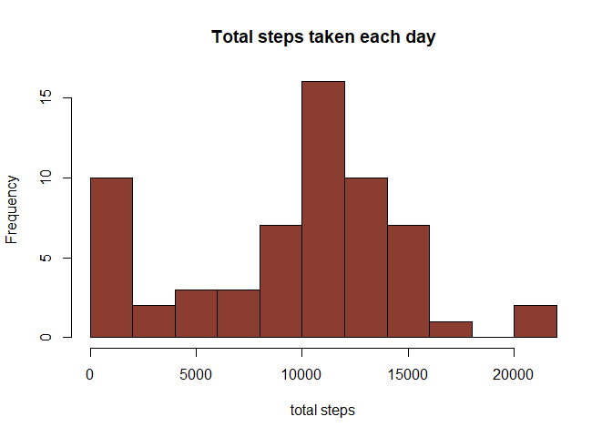
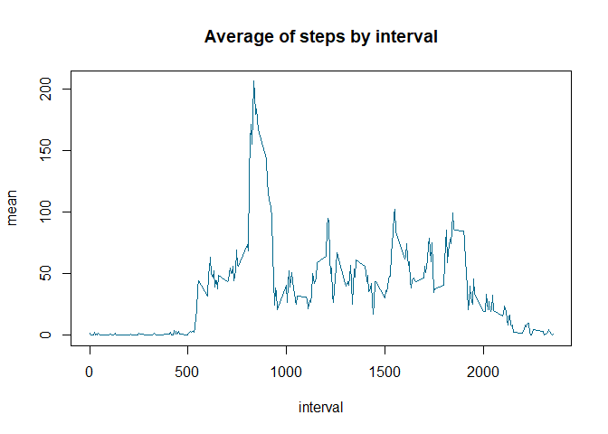
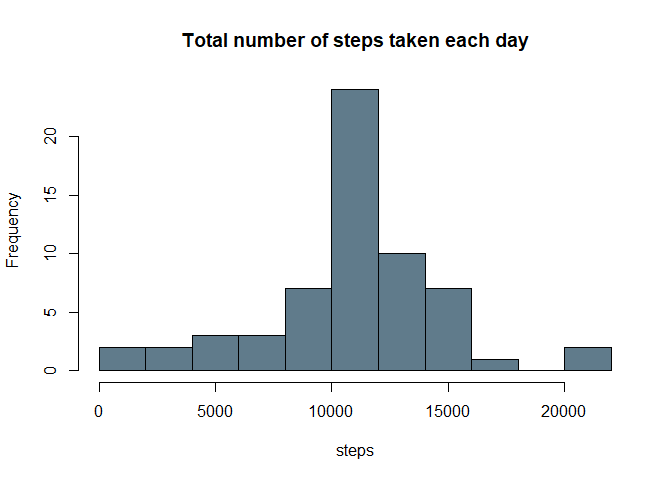
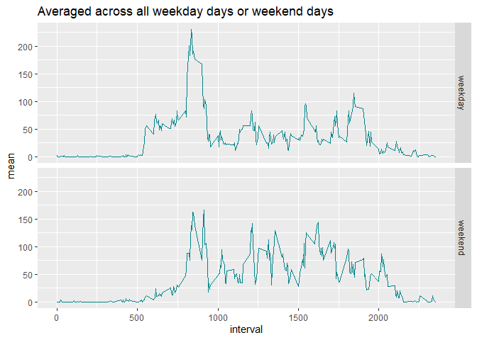

## Loading and preprocessing the data

First, we loaded the data and changed the class of the variables, so we can work with them.


```r
library(knitr)
library(ggplot2)
```


```r
data  <- read.csv("activity.csv")

data$steps <- as.numeric(data$steps)
data$date <- as.Date(as.character(data$date))
data$interval <- as.numeric(data$interval)
```


## What is mean total number of steps taken per day?

**1**. Calculate the total number of steps taken per day


```r
MeanPDay <- aggregate(data$steps, list(data$date), sum, na.rm=TRUE)
colnames(MeanPDay) <- c("date", "sum")
MeanPDay
```

```
##          date   sum
## 1  2012-10-01     0
## 2  2012-10-02   126
## 3  2012-10-03 11352
## 4  2012-10-04 12116
## 5  2012-10-05 13294
## 6  2012-10-06 15420
## 7  2012-10-07 11015
## 8  2012-10-08     0
## 9  2012-10-09 12811
## 10 2012-10-10  9900
## 11 2012-10-11 10304
## 12 2012-10-12 17382
## 13 2012-10-13 12426
## 14 2012-10-14 15098
## 15 2012-10-15 10139
## 16 2012-10-16 15084
## 17 2012-10-17 13452
## 18 2012-10-18 10056
## 19 2012-10-19 11829
## 20 2012-10-20 10395
## 21 2012-10-21  8821
## 22 2012-10-22 13460
## 23 2012-10-23  8918
## 24 2012-10-24  8355
## 25 2012-10-25  2492
## 26 2012-10-26  6778
## 27 2012-10-27 10119
## 28 2012-10-28 11458
## 29 2012-10-29  5018
## 30 2012-10-30  9819
## 31 2012-10-31 15414
## 32 2012-11-01     0
## 33 2012-11-02 10600
## 34 2012-11-03 10571
## 35 2012-11-04     0
## 36 2012-11-05 10439
## 37 2012-11-06  8334
## 38 2012-11-07 12883
## 39 2012-11-08  3219
## 40 2012-11-09     0
## 41 2012-11-10     0
## 42 2012-11-11 12608
## 43 2012-11-12 10765
## 44 2012-11-13  7336
## 45 2012-11-14     0
## 46 2012-11-15    41
## 47 2012-11-16  5441
## 48 2012-11-17 14339
## 49 2012-11-18 15110
## 50 2012-11-19  8841
## 51 2012-11-20  4472
## 52 2012-11-21 12787
## 53 2012-11-22 20427
## 54 2012-11-23 21194
## 55 2012-11-24 14478
## 56 2012-11-25 11834
## 57 2012-11-26 11162
## 58 2012-11-27 13646
## 59 2012-11-28 10183
## 60 2012-11-29  7047
## 61 2012-11-30     0
```

**2**. Make a histogram of the total number of steps taken each day

```r
hist(MeanPDay$sum, breaks = 10, 
     main = "Total steps taken each day", 
     xlab = "total steps", 
     col = "coral4")
```



**3**. Calculate and report the mean and median of the total number of steps taken per day

```r
d1 <- aggregate(data$steps, list(date= data$date), 
          FUN = function(x) c(mean1 = mean(x, na.rm = TRUE), median1 = median(x, na.rm = TRUE)))
d1
```

```
##          date    x.mean1  x.median1
## 1  2012-10-01        NaN         NA
## 2  2012-10-02  0.4375000  0.0000000
## 3  2012-10-03 39.4166667  0.0000000
## 4  2012-10-04 42.0694444  0.0000000
## 5  2012-10-05 46.1597222  0.0000000
## 6  2012-10-06 53.5416667  0.0000000
## 7  2012-10-07 38.2465278  0.0000000
## 8  2012-10-08        NaN         NA
## 9  2012-10-09 44.4826389  0.0000000
## 10 2012-10-10 34.3750000  0.0000000
## 11 2012-10-11 35.7777778  0.0000000
## 12 2012-10-12 60.3541667  0.0000000
## 13 2012-10-13 43.1458333  0.0000000
## 14 2012-10-14 52.4236111  0.0000000
## 15 2012-10-15 35.2048611  0.0000000
## 16 2012-10-16 52.3750000  0.0000000
## 17 2012-10-17 46.7083333  0.0000000
## 18 2012-10-18 34.9166667  0.0000000
## 19 2012-10-19 41.0729167  0.0000000
## 20 2012-10-20 36.0937500  0.0000000
## 21 2012-10-21 30.6284722  0.0000000
## 22 2012-10-22 46.7361111  0.0000000
## 23 2012-10-23 30.9652778  0.0000000
## 24 2012-10-24 29.0104167  0.0000000
## 25 2012-10-25  8.6527778  0.0000000
## 26 2012-10-26 23.5347222  0.0000000
## 27 2012-10-27 35.1354167  0.0000000
## 28 2012-10-28 39.7847222  0.0000000
## 29 2012-10-29 17.4236111  0.0000000
## 30 2012-10-30 34.0937500  0.0000000
## 31 2012-10-31 53.5208333  0.0000000
## 32 2012-11-01        NaN         NA
## 33 2012-11-02 36.8055556  0.0000000
## 34 2012-11-03 36.7048611  0.0000000
## 35 2012-11-04        NaN         NA
## 36 2012-11-05 36.2465278  0.0000000
## 37 2012-11-06 28.9375000  0.0000000
## 38 2012-11-07 44.7326389  0.0000000
## 39 2012-11-08 11.1770833  0.0000000
## 40 2012-11-09        NaN         NA
## 41 2012-11-10        NaN         NA
## 42 2012-11-11 43.7777778  0.0000000
## 43 2012-11-12 37.3784722  0.0000000
## 44 2012-11-13 25.4722222  0.0000000
## 45 2012-11-14        NaN         NA
## 46 2012-11-15  0.1423611  0.0000000
## 47 2012-11-16 18.8923611  0.0000000
## 48 2012-11-17 49.7881944  0.0000000
## 49 2012-11-18 52.4652778  0.0000000
## 50 2012-11-19 30.6979167  0.0000000
## 51 2012-11-20 15.5277778  0.0000000
## 52 2012-11-21 44.3993056  0.0000000
## 53 2012-11-22 70.9270833  0.0000000
## 54 2012-11-23 73.5902778  0.0000000
## 55 2012-11-24 50.2708333  0.0000000
## 56 2012-11-25 41.0902778  0.0000000
## 57 2012-11-26 38.7569444  0.0000000
## 58 2012-11-27 47.3819444  0.0000000
## 59 2012-11-28 35.3576389  0.0000000
## 60 2012-11-29 24.4687500  0.0000000
## 61 2012-11-30        NaN         NA
```


## What is the average daily activity pattern?

**1**. Make a time series plot of the 5-minute interval (x-axis) and the average number of steps taken, averaged across all days (y-axis)

We need the average of steps taken per interval, so I used the aggregate function and then plot the results.

```r
stepsInt <- aggregate(data$steps, list(data$interval), mean, na.rm = TRUE)
colnames(stepsInt) <- c("interval", "mean")
```


```r
plot(x = stepsInt$interval, y = stepsInt$mean, 
     type = "l", 
     main = "Average of steps by interval", 
     xlab = "interval", ylab = "mean",
     col = "deepskyblue4")
```




**2**. Which 5-minute interval, on average across all the days in the dataset, contains the maximum number of steps?


```r
maxi <- max(stepsInt$mean)
stepsInt[stepsInt$mean == maxi, ]
```

```
##     interval     mean
## 104      835 206.1698
```

The maximun number of steps is 206.1698113, then we look for the interval that has that number.

## Imputing missing values
**1**. Calculate and report the total number of missing values in the dataset

```r
sum(is.na(data$steps))
```

```
## [1] 2304
```

There are 2304 missing values in the data.

**2**. Devise a strategy for filling in all of the missing values in the dataset


**3**. Create a new dataset that is equal to the original dataset but with the missing data filled in

The strategy I used for filling the missing values is assign the mean for that 5-minute interval to the NA's values. The average of the 5-minute interval in the *stepsInt* data frame, so I created a new data frame called newData. 

```r
newData <- data
newData[is.na(newData$steps), ]$steps <- rep(stepsInt$mean, 8)
```

**4**. Make a histogram of the total number of steps taken each day and Calculate and report the mean and median total number of steps taken per day.

I calculated the average of the number of steps taken each day with the new data frame.


```r
TotalSteps <- aggregate(newData$steps, list(newData$date), sum)
colnames(TotalSteps) <- c("date", "total")
```


```r
hist(TotalSteps$total, breaks = 10, 
     main = "Total number of steps taken each day", 
     xlab = "steps", col = "lightskyblue4")
```




```r
d2 <- aggregate(newData$steps, list(date= newData$date), 
          FUN = function(x) c(mean1 = mean(x, na.rm = TRUE), median1 = median(x, na.rm = TRUE)))
d2
```

```
##          date    x.mean1  x.median1
## 1  2012-10-01 37.3825996 34.1132075
## 2  2012-10-02  0.4375000  0.0000000
## 3  2012-10-03 39.4166667  0.0000000
## 4  2012-10-04 42.0694444  0.0000000
## 5  2012-10-05 46.1597222  0.0000000
## 6  2012-10-06 53.5416667  0.0000000
## 7  2012-10-07 38.2465278  0.0000000
## 8  2012-10-08 37.3825996 34.1132075
## 9  2012-10-09 44.4826389  0.0000000
## 10 2012-10-10 34.3750000  0.0000000
## 11 2012-10-11 35.7777778  0.0000000
## 12 2012-10-12 60.3541667  0.0000000
## 13 2012-10-13 43.1458333  0.0000000
## 14 2012-10-14 52.4236111  0.0000000
## 15 2012-10-15 35.2048611  0.0000000
## 16 2012-10-16 52.3750000  0.0000000
## 17 2012-10-17 46.7083333  0.0000000
## 18 2012-10-18 34.9166667  0.0000000
## 19 2012-10-19 41.0729167  0.0000000
## 20 2012-10-20 36.0937500  0.0000000
## 21 2012-10-21 30.6284722  0.0000000
## 22 2012-10-22 46.7361111  0.0000000
## 23 2012-10-23 30.9652778  0.0000000
## 24 2012-10-24 29.0104167  0.0000000
## 25 2012-10-25  8.6527778  0.0000000
## 26 2012-10-26 23.5347222  0.0000000
## 27 2012-10-27 35.1354167  0.0000000
## 28 2012-10-28 39.7847222  0.0000000
## 29 2012-10-29 17.4236111  0.0000000
## 30 2012-10-30 34.0937500  0.0000000
## 31 2012-10-31 53.5208333  0.0000000
## 32 2012-11-01 37.3825996 34.1132075
## 33 2012-11-02 36.8055556  0.0000000
## 34 2012-11-03 36.7048611  0.0000000
## 35 2012-11-04 37.3825996 34.1132075
## 36 2012-11-05 36.2465278  0.0000000
## 37 2012-11-06 28.9375000  0.0000000
## 38 2012-11-07 44.7326389  0.0000000
## 39 2012-11-08 11.1770833  0.0000000
## 40 2012-11-09 37.3825996 34.1132075
## 41 2012-11-10 37.3825996 34.1132075
## 42 2012-11-11 43.7777778  0.0000000
## 43 2012-11-12 37.3784722  0.0000000
## 44 2012-11-13 25.4722222  0.0000000
## 45 2012-11-14 37.3825996 34.1132075
## 46 2012-11-15  0.1423611  0.0000000
## 47 2012-11-16 18.8923611  0.0000000
## 48 2012-11-17 49.7881944  0.0000000
## 49 2012-11-18 52.4652778  0.0000000
## 50 2012-11-19 30.6979167  0.0000000
## 51 2012-11-20 15.5277778  0.0000000
## 52 2012-11-21 44.3993056  0.0000000
## 53 2012-11-22 70.9270833  0.0000000
## 54 2012-11-23 73.5902778  0.0000000
## 55 2012-11-24 50.2708333  0.0000000
## 56 2012-11-25 41.0902778  0.0000000
## 57 2012-11-26 38.7569444  0.0000000
## 58 2012-11-27 47.3819444  0.0000000
## 59 2012-11-28 35.3576389  0.0000000
## 60 2012-11-29 24.4687500  0.0000000
## 61 2012-11-30 37.3825996 34.1132075
```

## Are there differences in activity patterns between weekdays and weekends?

We can see the histogram of the total number of steps taken each day is different form the first histogram with the original data, so we can say that there are differences in activity patterns. 

**1**. Create a new factor variable in the dataset with two levels – “weekday” and “weekend” indicating whether a given date is a weekday or weekend day.

```r
newData$dayType <- "weekday"
newData[weekdays(newData$date) == "domingo" | weekdays(newData$date) == "sábado",]$dayType <- "weekend"
```

**2**. Make a panel plot containing a time series plot of the 5-minute interval (x-axis) and the average number of steps taken, averaged across all weekday days or weekend days (y-axis). 

```r
data2 <- aggregate(newData$steps, list(newData$interval, newData$dayType), mean)
colnames(data2) <- c("interval", "daytype", "mean")
```


```r
g2 <- ggplot(data2, aes(interval, mean)) +
  geom_line(col = "turquoise4") + 
  facet_grid(daytype~.)+
  ggtitle("Averaged across all weekday days or weekend days")
g2
```



